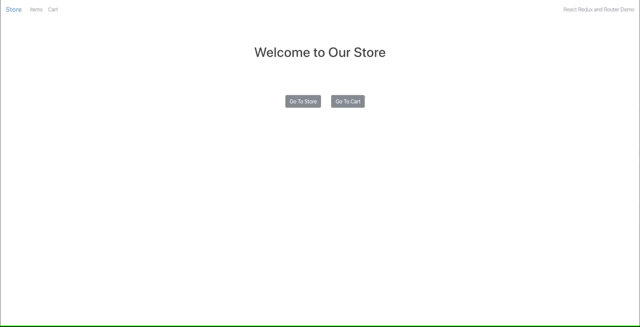

# Technical Report Demo: React UI

i

### Welcome to the demo for our presentation below are a couple of instructions to get started. 

- For this demo we will be using yarn as a package manager
  - If you have a Mac or linux machine please install brew with the following command
    ```
    /bin/bash -c "$(curl -fsSL https://raw.githubusercontent.com/Homebrew/install/master/install.sh)"
    ```
  - After installing brew run the following command in your command line
    ```
    $ brew install yarn 
    ```
  ---
  - If you have a windows machine refer to the following link for instructions on how to install [yarn](https://classic.yarnpkg.com/en/docs/install/#windows-stable)

- Fork and clone this repo to your local machine
- Once cloned enter the directory and run
    ```
    $ yarn install
    ```
  - This installs all of the dependencies we will be using for the demo
- To run a local server in development mode run 
    ```
    $ yarn start
    ```
    - This local server reloads automatically when we make changes

- If you need to look at the final code for reference it can be found on the final-build branch

This is all you need to get started on our demo, enjoy!
